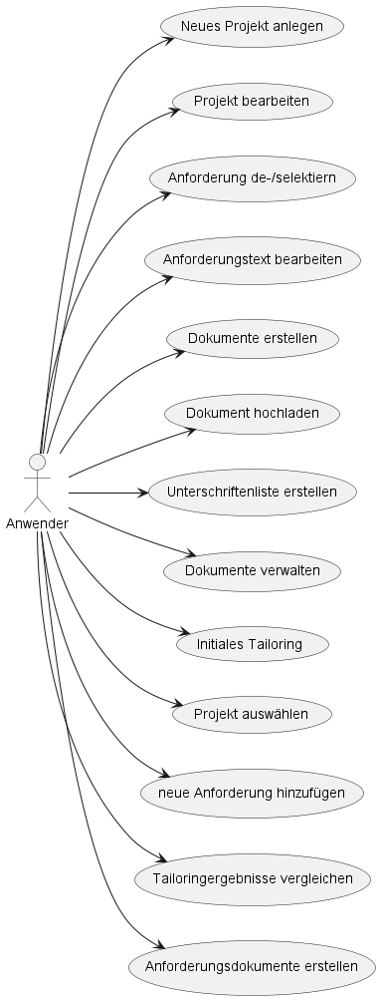

# Tailoring

## About

| __Build Status__ | [](https://github.com/baedorf/tailoringexpert-plattform/actions/workflows/build.yml) |
| :--- | :--- |
| __Coverage__ |   |
| __Source Info__ | [](https://github.com/baedorf/tailoringexpert-plattform/blob/main/LICENSE)  |


## Enwicklungsrichtlinien

Es gelten die [Entwicklungsrichtlinien](src/site/markdown/development.md "Entwicklungsrichtlinien").

## Use Cases



## Module

### Maven Modul-Struktur

| Modulname                | Beschreibung                                                                                                                                |
|:-------------------------|:--------------------------------------------------------------------------------------------------------------------------------------------|
| tailoringexpert-core     | Der Anwendungskern (die Domäne) mit der Anwendungslogik.                                                                                    |
| tailoringexpert-data-jpa | Implementiert die Schnittstellen für den Datenzugriff des fachlichen Kerns mittels Spring Data JPA                                          |
| tailoringexpert-rest     | Restschnittstelle für den Zugriff für die Plattform                                                                                         |
| tailoringexpert-poi      | Modul für die Bereitstellung von Excel Im- und Exprten der TailoringExpert Plattform.                                                       | 
| tailoringexpert-openhtmltopdf   | Modul für die Bereitstellung von PDF Dateien mittels Openhtmltopdf der TailoringExpert Plattform.                                           | 
| tailoringexpert-security | Modul für die Security Konfiguration der TailoringExpert Plattform mittels spring-security OHNE Verwendung eines externen Identity Managers |
| tailoringexpert-tenant   | Definition und Implementierung von Proxies für mandantenspezfische Schnittstellen der TailoringExpert Plattform.                            |

### Level 0


## Level 1


### Verwendete Libraries

| Libary         | Version       |
|----------------|---------------|
| Spring Boot    | 2.6.2.RELEASE |
| openhtmltopdf | 1.0.10        |
| poi | 5.0.0 |

## Deployment


## Bauen des Anwendung

### Voraussetzungen

- Java 11 JDK
- Maven

### Build

Ohne Angabe eines Profiles werden mittels

> mvn clean install

## Vorbereitung Datenbank

### Voraussetzung

Es muss ein Datenbankschema mit einem Benutzer vorhanden sein

#### Schema anlagen

```
CREATE USER 'tailoringexpert'@'%' IDENTIFIED BY 'test1234';
CREATE DATABASE TAILORINGEXPERT CHARACTER SET utf8mb4;
GRANT ALL PRIVILEGES ON TAILORINGEXPERT.* TO 'tailoringexpert'@'%;'
```

#### Tabellenstrukturen erstellen/aktualisieren

Die Datenbankskripte liegen in Form von _liquibase_ XML-Dateien im Projekt _tailoringexpert-data-jpa_ vor.
Die Tabellen und Contraints werden mittels

> mvn -P develop install exec:exec@dropAll exec:exec@install exec:exec@update

auf die Datenbank angewendet.
Für die Anlage des Datenbanks ist unter

    tailoringexpert-data-jpa/src/assembly/runConfigurations

eine Intellij Run-Configuration vorhanden.

### Basiskatalog

Für die Entwicklung existeriert ein Katalog in Form einer importierbaren JSON Datei.
Dieser kann z.B. mittel Postman eingespielt werden. Dafür muss die Plattform und ein Beispielmandant gestartet werden.

## Starten der Anwendung

Beim TailoringExpert handelt sich es um eine mandantenfähige Spring Boot Anwendung.
Die Haupt-/Starterklasse ist

> eu.tailoringexpert.App

und kann mittels java eu.tailoringexpert.App gestartet werden

Jeder Mandant muss seine Konfiguration in dem Paket

> eu.tailoringexpert

anlegen. Nur so kann diese beim Start der Plattform angezogen werden.

## Links

- [Schnittstellen Dokumentation (Swagger)](http://localhost:8080/swagger-ui.html#/)
- [Liquibase](https://www.liquibase.org/)
- [Lombok](https://projectlombok.org/)
- [Mapstruct](https://mapstruct.org/)
- [Plantuml](https://plantuml.com/)
