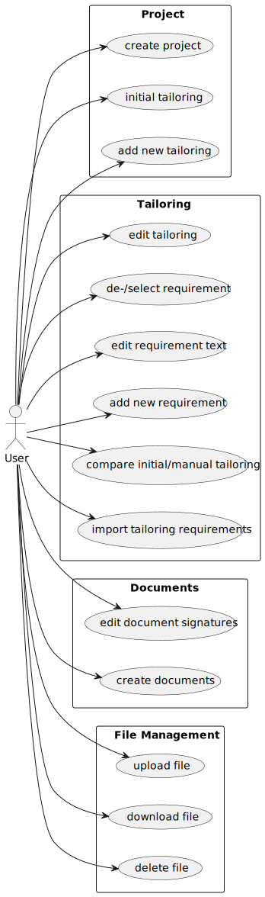

# TailoringExpert

## About

| __Build Status__ |  |
|:-----------------| :--- |
| __Coverage__     |   |
| __Source Info__  |   |

## Development policies

[development policies](src/site/markdown/development.md "Entwicklungsrichtlinien") shall be used.

## Use Cases

## Architecture documentation

Architecture documentation can be found here as [arc42](src/site/arc42/tailoringexpert.adoc) document.

## Module

### Maven Modul-Struktur

| Modulname                | Beschreibung                                                                                                                 |
|:-------------------------|:-----------------------------------------------------------------------------------------------------------------------------|
| tailoringexpert-core     | Business core of plattform.                                                                                                  |
| tailoringexpert-data-jpa | Implementation of data access needed by core component                                                                       |
| tailoringexpert-rest     | Component providing REST services of plattform                                                                               |
| tailoringexpert-poi      | Module for importing requirements and generating Excel files using POI.                                                      | 
| tailoringexpert-openhtmltopdf   | Module for generating PDF documents using  Openhtmltop.                                                                      | 
| tailoringexpert-security | Security configuration using spring-security without using an external identity manager                                      |
| tailoringexpert-tenant   | Proxies for tenant implementations of type TenantInterface. |

### Level 0

## Level 1

## Deployment

## Build application

### Prerequisites

- Java 11 JDK
- Maven
    - profile containing liquibase properties for integration test

### Build

To build the plattform it is recommended to create a profile containing `liquibase` properties for intgegration test
database connection.

Plattform can be build using

> mvn -P tailoringexpert-plattform.local clean install

### Run

For testing purpose there is a sample plattform in module `tailoringexpert-integrationtest`.
See instructions for setting up and running the (demo) system in [README.md](tailoringexpert-integrationtest/README.md)

## Links

- [Schnittstellen Dokumentation (Swagger)](http://localhost:8080/swagger-ui.html#/)
- [Liquibase](https://www.liquibase.org/)
- [Lombok](https://projectlombok.org/)
- [Mapstruct](https://mapstruct.org/)
- [Plantuml](https://plantuml.com/)
- [dotenv-java](https://github.com/cdimascio/dotenv-java) 
